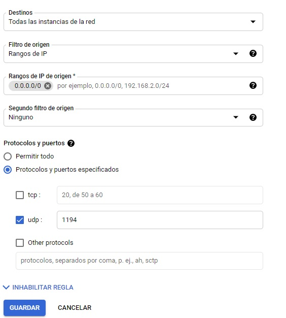

# Practica1 GRUPO 9

## UNIVERSIDAD SAN CARLOS DE GUATEMALA
## FACULTAD DE INGENIERIA 
## REDES DE COMPUTADORAS 1
---------------------------------------------------------------------------
### INTEGRANTES
- ERICK VALENZUELA
- FERNANDO AMBROSIO
- AARON JUAREZ 
- SOHANY LOPEZ
---------------------------------------------------------------------------
### HERRAMIENTAS UTILIZADAS
- Equipo.
    - 4 computadores con sistema operativo libre *"windows 10 o ubuntu"*
- Software.
    - Administradors VPNs *"OpenVPN"*
- Plataforma
    - Google Cloud Plataform (GCP)
---------------------------------------------------------------------------
### DESCRIPCION DE LA PRACTICA
Creacion de una red VPN implmentado en un servicio en la nube :rocket:, logrando conectar varias computadoras :computer: a dicha red pudiendose comunicar las unas a las otras por medio de internet.

   <p>
    
   </p>

---------------------------------------------------------------------------
### PASOS PARA CREACION DE UNA RED VPN
1. Creacion de maquina virtual
    * Para la creacion de la maquina virtual se debe contar con una cuenta de google, procedemos a ir hacia el area de *compute engine* y luego en *virtual machine* en esta area le damos en agrear nueva instancia, y nos saldra la siguiente imagen en donde podremos configurar nuestra instancia de VM, aqui podemos escoger las propiedades que queres para nuestra maquina, para la practica se utilizaron las siguiente.
        * SO: ubuntu debian.
        * Maquina virtual de 2 nucleos y 8gb de ram 
        * Acceso predeterinado
        * trafico http y https
<p align="center">
    
</p>

2. Arrangue de Maquina virutal
    * Para este paso solmante debemos de seleccionar la maquina virutal que creamos y darle click derecho e iniciar maquina virtual.
<p align="center">
    
</p>

3. Uso de maquina virtual
    * Cuando la maquina virtual y esta corriendo debemos de seleccionar la opcion que nos parece de SSH, esta opcion nos abrira una venta que es la consola del sistema operativo que escogimos en este caso seria la consola de ubuntu Debian.
    * Lo primero que debemos hacer es actualizar las libreria del sistema operativo para esto utilizamos el comando 
    ```
    npm apt-get update
    ```
    * luego de ingresar el anterior comando damos enter y esperamos a que termine de realizar las actualizaciones
<p align="center">
    
</p>

4. Instalacion del paquete *WGET*
    * Este paquete nos servire para poder descargar archivos a travez de una url, para poder saber si tenes instalado el paquete *wget* en nuestro sistema operativo en este caso ubuntu, debemos ingresar el siguiente comando.
    ```
    sudo wget -v
    ```
    * Si al ingresar este comando nos sale un mensaje como en la imagen que dice *command not found* debemos de instalar este paquete en nuestro sistema operativo, para esto debemos escribir el siguiente comando.
    ```
    sudo apt-get install wget
    ```
    * Al ingresar este comando y darle enter comenzara la descarga e instalacion de este paquete, tal y como se muestra en la imagen.
<p align="center">
    
</p>

5. Verficiar si el paquete *WGET* quedo correctamente instalado
    * Para poder verficar si el paquete quedo debidamente instalado debemos de ingresar en el siguiente comando.
    ```
    sudo -i
    ```
    * el anterior comando nos permite ser super usuarios, luego escribimos en la consola.
    ```
    wget -v
    ```
    * Tal y como se nos muestra en la imagen sabremos que todo quedo debidamente instalado.
<p align="center">
    
</p>

6. Instalacion de *OpenVPN*
    *  Para poder instlar nuestra herramienta que nos permitira crear una red vpn, en este caso OpenVPN, debemos igualmente ingresar el siguiente comando.
    ```
    sudo wget https://cubaelectronica.com/OpenVPN/openvpn-install.sh
    ```
    * Al ingresar el comando se nos deplegara la siguiente pantalla, donde nos mostrar la direccion ip de nuestra maquina virtual y para poder continuar le damos enter.
<p align="center">
    
</p>

7. Ingreso de ip publica de maquina virtual
    * Despues del paso anterior el programa nos pedira nuestra ip publica, para poder saber cual es nuestra ip publica, nos dirigimos a nuestro navegador y en la consola de google cloud donde nos muestra nuestras maquinas virutal buscamos la maquina virtual que estamos utlizando actualmente y buscamos el apartado de ip public, copiamos el numero que se nos otorga y lo pegamos en nuestra consola.
<p align="center">
    
</p>

8. Protocolo para conexiones VPN
    * Luego de realizar el siguiente paso el programa nos pedira que escojamos el tipo de protocolo que queremos para nuestras conexiones, en este caso escojeremos el *UDP* ya que este es el protocolo que nos interesa, para esto solo debemos ingresar el numero que corresponde al protocolo que queremos y le damos enter.
<p align="center">
    
</p>

9. Puerto de escucha y DNS de red VPN
    * Como siguiente paso debemos de ingresar el puerto de escucha de nuestra red vpn, en este caso se escogio el 1194.
    * Luego de ingresar nuestro puerto vamos a ingresar nuestro DNS, este nos indica en que zona de autoridad nos queremos ubicar, en este caso usaremos el DNS de google, para esto ingresamos el numero correspondiente a google.
<p align="center">
    
</p>

10. Certificado de Cliente
    * Despues de realizar lo anterior nos pedira que ingresemos el nombre del certificado de nuestro cliente, con esto podremos identificar a nuestra manera a que cliente le estamos asignando el certicado que estamos creando, para esto solo debemos ingresar el nombre que queremos con las especificaciones que nos pide OpenVPN, en este caso utilizamos fernando como ejemplo.
        * *Nota: despues de ingresar el nombre y darle enter puede tardar algunos minutos en crear el certificado.*
<p align="center">
    
</p>

11. Creacion de reglas de *FIREWALL*
    * Lo siguiente que debemos realizar el crear dos reglas de firewall, estas nos serviran para poder dar acceso y garantizar la seguridad de nuestra maquina virtual.
        * El primer paso para crear nuestras reglas de firewall es ir al menu y luego RED DE VPC, aqui encontraremos el apartado de firewall y le damos en crar nueva regla.
        * Primero nos pedira el nombre que queremos para nuestra regla, en este caso ya que son dos reglas, una para entrada y otra para salida de conexiones, usaremos ALLIN Y ALLOUT, las configuraciones para dicha regla son las mismas solamente cambiara que en el apartaod de direccion de trafico en una sera entrada y la otra salida.
        * 
<p align="center">
    
</p>

3. texto
    * texto
<p align="center">
    
</p>

3. texto
    * texto
<p align="center">
    
</p>

3. texto
    * texto
<p align="center">
    
</p>

3. texto
    * texto
<p align="center">
    
</p>

3. texto
    * texto
<p align="center">
    
</p>

3. texto
    * texto
<p align="center">
    
</p>

3. texto
    * texto
<p align="center">
    
</p>

3. texto
    * texto
<p align="center">
    
</p>

3. texto
    * texto
<p align="center">
    
</p>

3. texto
    * texto
<p align="center">
    
</p>

3. texto
    * texto
<p align="center">
    
</p>

3. texto
    * texto
<p align="center">
    
</p>

3. texto
    * texto
<p align="center">
    
</p>
