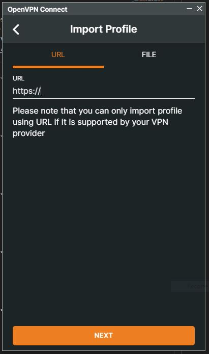

# Practica1 GRUPO 9

## UNIVERSIDAD SAN CARLOS DE GUATEMALA
## FACULTAD DE INGENIERIA 
## REDES DE COMPUTADORAS 1
---------------------------------------------------------------------------
### INTEGRANTES
- ERICK VALENZUELA
- FERNANDO AMBROSIO
- AARON JUAREZ 
- SOHANY LOPEZ
---------------------------------------------------------------------------
### HERRAMIENTAS UTILIZADAS
- Equipo.
    - 4 computadores con sistema operativo libre *"windows 10 o ubuntu"*
- Software.
    - Administradors VPNs *"OpenVPN"*
- Plataforma
    - Google Cloud Plataform (GCP)
---------------------------------------------------------------------------
### DESCRIPCION DE LA PRACTICA
Creacion de una red VPN implmentado en un servicio en la nube :rocket:, logrando conectar varias computadoras :computer: a dicha red pudiendose comunicar las unas a las otras por medio de internet.

   <p>
    
   </p>

---------------------------------------------------------------------------
### PASOS PARA CREACION DE UNA RED VPN
1. Creacion de maquina virtual
    * Para la creacion de la maquina virtual se debe contar con una cuenta de google, procedemos a ir hacia el area de *compute engine* y luego en *virtual machine* en esta area le damos en agrear nueva instancia, y nos saldra la siguiente imagen en donde podremos configurar nuestra instancia de VM, aqui podemos escoger las propiedades que queres para nuestra maquina, para la practica se utilizaron las siguiente.
        * SO: ubuntu debian.
        * Maquina virtual de 2 nucleos y 8gb de ram 
        * Acceso predeterinado
        * trafico http y https
<p align="center">
    
</p>

2. Arrangue de Maquina virutal
    * Para este paso solmante debemos de seleccionar la maquina virutal que creamos y darle click derecho e iniciar maquina virtual.
<p align="center">
    
</p>

3. Uso de maquina virtual
    * Cuando la maquina virtual y esta corriendo debemos de seleccionar la opcion que nos parece de SSH, esta opcion nos abrira una venta que es la consola del sistema operativo que escogimos en este caso seria la consola de ubuntu Debian.
    * Lo primero que debemos hacer es actualizar las libreria del sistema operativo para esto utilizamos el comando 
    ```
    npm apt-get update
    ```
    * luego de ingresar el anterior comando damos enter y esperamos a que termine de realizar las actualizaciones
<p align="center">
    
</p>

4. Instalacion del paquete *WGET*
    * Este paquete nos servire para poder descargar archivos a travez de una url, para poder saber si tenes instalado el paquete *wget* en nuestro sistema operativo en este caso ubuntu, debemos ingresar el siguiente comando.
    ```
    sudo wget -v
    ```
    * Si al ingresar este comando nos sale un mensaje como en la imagen que dice *command not found* debemos de instalar este paquete en nuestro sistema operativo, para esto debemos escribir el siguiente comando.
    ```
    sudo apt-get install wget
    ```
    * Al ingresar este comando y darle enter comenzara la descarga e instalacion de este paquete, tal y como se muestra en la imagen.
<p align="center">
    
</p>

5. Verficiar si el paquete *WGET* quedo correctamente instalado
    * Para poder verficar si el paquete quedo debidamente instalado debemos de ingresar en el siguiente comando.
    ```
    sudo -i
    ```
    * el anterior comando nos permite ser super usuarios, luego escribimos en la consola.
    ```
    wget -v
    ```
    * Tal y como se nos muestra en la imagen sabremos que todo quedo debidamente instalado.
<p align="center">
    
</p>

6. Instalacion de *OpenVPN*
    *  Para poder instlar nuestra herramienta que nos permitira crear una red vpn, en este caso OpenVPN, debemos igualmente ingresar el siguiente comando.
    ```
    sudo wget https://cubaelectronica.com/OpenVPN/openvpn-install.sh
    ```
    * Al ingresar el comando se nos deplegara la siguiente pantalla, donde nos mostrar la direccion ip de nuestra maquina virtual y para poder continuar le damos enter.
<p align="center">
    
</p>

7. Ingreso de ip publica de maquina virtual
    * Despues del paso anterior el programa nos pedira nuestra ip publica, para poder saber cual es nuestra ip publica, nos dirigimos a nuestro navegador y en la consola de google cloud donde nos muestra nuestras maquinas virutal buscamos la maquina virtual que estamos utlizando actualmente y buscamos el apartado de ip public, copiamos el numero que se nos otorga y lo pegamos en nuestra consola.
<p align="center">
    
</p>

8. Protocolo para conexiones VPN
    * Luego de realizar el siguiente paso el programa nos pedira que escojamos el tipo de protocolo que queremos para nuestras conexiones, en este caso escojeremos el *UDP* ya que este es el protocolo que nos interesa, para esto solo debemos ingresar el numero que corresponde al protocolo que queremos y le damos enter.
<p align="center">
    
</p>

9. Puerto de escucha y DNS de red VPN
    * Como siguiente paso debemos de ingresar el puerto de escucha de nuestra red vpn, en este caso se escogio el 1194.
    * Luego de ingresar nuestro puerto vamos a ingresar nuestro DNS, este nos indica en que zona de autoridad nos queremos ubicar, en este caso usaremos el DNS de google, para esto ingresamos el numero correspondiente a google.
<p align="center">
    
</p>

10. Certificado de Cliente
    * Despues de realizar lo anterior nos pedira que ingresemos el nombre del certificado de nuestro cliente, con esto podremos identificar a nuestra manera a que cliente le estamos asignando el certicado que estamos creando, para esto solo debemos ingresar el nombre que queremos con las especificaciones que nos pide OpenVPN, en este caso utilizamos fernando como ejemplo.
        * *Nota: despues de ingresar el nombre y darle enter puede tardar algunos minutos en crear el certificado.*
<p align="center">
    
</p>

11. Creacion de reglas de *FIREWALL*
    * Lo siguiente que debemos realizar el crear dos reglas de firewall, estas nos serviran para poder dar acceso y garantizar la seguridad de nuestra maquina virtual.
        * El primer paso para crear nuestras reglas de firewall es ir al menu y luego RED DE VPC, aqui encontraremos el apartado de firewall y le damos en crar nueva regla.
        * Primero nos pedira el nombre que queremos para nuestra regla, en este caso ya que son dos reglas, una para entrada y otra para salida de conexiones, usaremos ALLIN Y ALLOUT, las configuraciones para dicha regla son las mismas solamente cambiara que en el apartaod de direccion de trafico en una sera entrada y la otra salida.
<p align="center">
    
</p>

12. Propiedades de la regla de Firewall
    * Para este paso procederemos a configurar el destino, filtro de origen, rango de ip, protocolos y puertos.
        * Para los destino seleccionaremos todas las instancias de red.
        * filtros de origen usaremos Rangos de IP
        * Definiremos nuestros rangos de IP permitidos
            - rango permitidos: 0.0.0.0/0
        * filtro de orignen ninguno
        * protocolos y puertos, escogeremos protocolos y puertos especificados
            * utiizaremos el protocolo UPD, con el puerto 1194
<p align="center">
    
</p>

13. Espacio de reglas
    * al terminar de confirar nuestras reglas estas se mostraran com en la siguiente imagen.
<p align="center">
    
</p>

14. Descarga de perfil de cliente.
    * Despues de configurar nuestras regla de firewall regresamos a nuestra consola y ya habiendo terminado nuestro programa de crear el perfil de cliente, procederemos a descargarlo, como se muestra en la imagen el perfil esta guardado en la ruta resaltada, solo debemos de descargar este archivo.
<p align="center">
    
</p>

15. Descarga de archivo
    * Para descargar el archivo debemos de ubicarno en la roldana que se encuentra en la parate superior derecha y le damos descargar archivos, e ingresamos la ruta que nos dio el programa, luego se nos descargara saliendonos de la siguiente forma que fue exitosa la descarga.
<p align="center">
    
</p>

16. Prueba de Perfiles (Carga de Archivo)
    * Para poder probar nuestros perfiles que hemos creado debemos de instalar OpenVpn en nuestra maquina fisica, desde donde nos conectaremos a nuestra maquina virtual ubicada en la nube, para esto vamos al siguiente link.
        - [https://openvpn.net/vpn-client/](https://openvpn.net/vpn-client/)
    * despues de descargar e instalar nos saldra la siguiente imagen, donde le daremos en el apartado de FILE y nos pedira un archivo, en este caso buscaremos el archivo que acabmos de descargar en el paso anterior
<p align="center">
    
</p>

17. Prueba de perfil
    * Despues de cargar el archivo se presentara la siguiente pantalla en donde debemos darle en connect y asi empezara la prueba de nuestro cliente.
<p align="center">
    
</p>

18. Conexion 
    * Luego de realizar el paso anterior se nos mostrara la siguiente pantalla donde ya nos dira si la conexion fue exitosa y nos mostrara todos los datos de nuestro servidor de red VPN que hemos creado.
<p align="center">
    
</p>

19. Comprobacion de conexion exitosa
    * Para poder determinar que nuestra conexion fue exitosa, debemos abrir la consola de nuestra computadora fisica e ingresa el siguiente comando.
    ```
    ipconfig
    ```
    * Al realizar lo anterior no debe de aparecer en la direccion IPv4 la direccion ip de nuestro servidor VPN, tal y como se muestra en la siguiente imagen.
<p align="center">
    
</p>

20. Comprobacion externa de ip
    * Si queremos determinar de una forma externa que nuestra ip cambio debido a que estamos conectados a nuestro servidor VPN, podemos utilizar la siguiente pagina.
     - [https://www.cual-es-mi-ip.net/](https://www.cual-es-mi-ip.net/)
<p align="center">
    
</p>

21. Comprobacion de conexion desde servido VPN
    * Para realizar esta prueba debemos de escribir el siguiente comando en la consola de nuestra maquina virtual donde esta el servidor VPN
    ```
    ping "ip de nuestra maquina fisica"
    ```
    * despues de realizar lo anterior se nos debe de mostrar como en la siguiente siguiente.
        - *NOTA: si en dado caso no relizara ninguna accion debemos de desactivar el firewall de nuestra maquina fisica a la cual nos estamos comunicando.*
<p align="center">
    
</p>

22. Creacion de nuevos Perfiles
    * Para poder crear nuesvos perfiles debemos de ejecutar nuevamente el siguiente comando.
    ```
    sudo wget https://cubaelectronica.com/OpenVPN/openvpn-install.sh
    ```
    * Desplegandose lo que se muestra en la siguiente imagen, donde solo debemos ingresar el numero que corresponde a la opcion de agrega nuevo usuario.
    * Ahora solomante nos pedira ingresar el nombre del nuevo usaurio y procedera a crear el nuevo perfil de client.
<p align="center">
    
</p>

23. Pruebas de conexion a nuevo cliente
    * Como en las anteriores pruebas solamente debemos de hacer ping a la direccion ip de nuestro nuevo cliente y recibiremos la respuesta de solicitud
        - De igual forma si no recibimos ninguna respuesta se debe de deshabilitar el firewall de nuestra nuevo cliente en su maquina fisica.
<p align="center">
    
</p>

